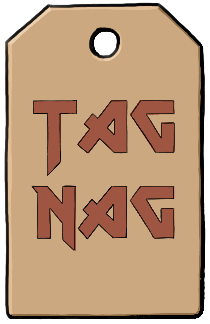

<div align="center">

</div>

# tag-nag


Validate AWS tags in Terraform and CloudFormation.  

Designed to run in a pipeline or as part of pre-deployment checks.  

## Installation
```bash
go install github.com/jakebark/tag-nag@latest
```
You may need to set [GOPATH](https://go.dev/wiki/SettingGOPATH).

### Docker
```bash
docker pull jakebark/tag-nag:latest
docker run --rm -v $(pwd):/workspace jakebark/tag-nag --tags "Owner,Environment" /workspace

```

## Commands

Tag nag will search a file or directory for tag keys. Directory search is recursive.

```bash
tag-nag <file/directory> --tags "<tagKey1>,<tagKeyN>"

tag-nag main.tf --tags "Owner" # run against a file
tag-nag ./my_project --tags "Owner,Environment" # run against a directory
tag-nag . --tags "Owner", "Environment" # will take string or list

```

Search for tag keys *and* values

```bash
tag-nag <file/directory> --tags "<tagKey1>=<tagValue1>"

tag-nag main.tf --tags "Owner[Jake]" 
tag-nag main.tf --tags "Owner[Jake],Environment" # mixed search possible
tag-nag main.tf --tags "Owner[Jake],Environment[Dev,Prod]" # multiple options for tag values

```

Optional flags 
```bash
-c # case-insensitive 
-d # dry-run (will always exit successfully)
```

## Skip Checks
Skip file
```hcl
#tag-nag ignore-all
```

Terraform
```hcl
resource "aws_s3_bucket" "this" {
  #tag-nag ignore
  bucket   = "that"
}
```

CloudFormation
```yaml
EC2Instance:  #tag-nag ignore
    Type: "AWS::EC2::Instance"
    Properties: 
      ImageId: ami-12a34b
      InstanceType: c1.xlarge   
```


## Related Resources

- [pkg.go.dev/github.com/jakebark/tag-nag](https://pkg.go.dev/github.com/jakebark/tag-nag)
